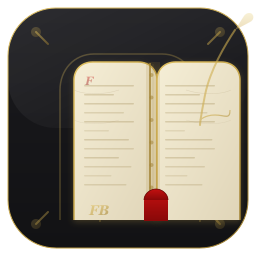

<div align="center">

# FantasyBook Maker

**A desktop worldbuilding and manuscript writing tool**

<p align="center">
  
</p>

<p align="center">
  
  
  
  
  
</p>

</div>

---

## About

FantasyBook Maker is a complete offline desktop application for writers and worldbuilders. It combines a **rich manuscript editor** with a **wiki-style codex** (Códice) for organizing characters, locations, magic systems, creatures, and everything else in your fictional world.

All data is stored locally in a SQLite database — no cloud, no accounts, no subscriptions.

---

## Features

### 📖 Manuscript Editor (Manuscrito)
- Rich-text chapter editor powered by [TipTap](https://tiptap.dev/)
- Formatting toolbar: bold, italic, colors, highlights, images
- Entity reference autocomplete — type `@` to link characters, places, etc.
- Daily word count goals with progress tracking
- Auto-save with keyboard shortcuts

### 📚 Book Viewer (Libro)
- Two-page spread with page-flip animations
- Gothic-styled book with aged paper texture, spine, bookmark ribbon
- Entity tooltips — hover over linked names to see codex entries
- Adjustable font size, single/double page mode, fullscreen
- Keyboard navigation and quick chapter selector

### 🏰 Codex (Códice)
- Organize world information into categories:
  Characters, Locations, Magic, Creatures, Gods, History, Objects, Factions, Classes, Races, and more
- Rich-text descriptions with the same formatting tools
- Relational fields — link entities together (e.g., a character's home, race, faction)
- Custom schema designer — add your own fields per category

### 📊 Visual Tools
- **Timeline** — chronological view of history entries
- **Graph** — force-directed relationship graph of all entities, filterable by category
- **Split View** — browse the Codex alongside your manuscript

### 🎨 Theme
- Dark gothic aesthetic with gold, parchment, and blood-red accents
- Inspired by illuminated manuscripts and medieval books
- Available in seven views accessible from the top navigation bar

---

## Tech Stack

| Layer | Technology |
|-------|-----------|
| Desktop Shell | [Electron 28](https://www.electronjs.org/) |
| UI Framework | [React 19](https://react.dev/) |
| Language | [TypeScript 5.3](https://www.typescriptlang.org/) |
| Styling | [Tailwind CSS 3](https://tailwindcss.com/) |
| Rich Text | [TipTap](https://tiptap.dev/) (ProseMirror) |
| Database | [sql.js](https://sql.js.org/) (SQLite via WebAssembly) |
| Graph | [d3-force](https://d3js.org/d3-force) |
| Icons | [Phosphor Icons](https://phosphoricons.com/) |
| Build | [electron-vite](https://electron-vite.org/) / [electron-builder](https://www.electron.build/) |

---

## Getting Started

### Prerequisites

- [Node.js](https://nodejs.org/) >= 18
- npm (comes with Node.js)

### Install

```bash
git clone https://github.com/neukkken/FantasyBookMaker.git
cd FantasyBookMaker
npm install
```

### Development

```bash
npm run dev
```

This launches the app in development mode with hot module replacement.

### Build

```bash
# For Windows
npm run build:win

# For macOS
npm run build:mac

# For Linux
npm run build:linux
```

The packaged application will be in the `dist/` folder.

---

## Project Structure

```
src/
├── main/           # Electron main process
│   ├── index.ts
│   ├── database.ts       # SQLite management
│   ├── codiceManager.ts  # Entity CRUD
│   └── manuscritoManager.ts  # Chapter CRUD
├── preload/        # Electron preload bridge
│   └── index.ts
└── renderer/       # React UI
    └── src/
        ├── App.tsx
        ├── context/
        │   └── CodiceContext.tsx
        ├── components/
        │   ├── VistaLibro.jsx      # Book viewer
        │   ├── PanelEscritura.jsx   # Manuscript editor
        │   ├── ExploradorArchivosGotico.jsx  # Codex browser
        │   ├── ModalCodice.jsx      # Entity editor modal
        │   ├── PanelGrafico.jsx     # Relationship graph
        │   ├── PanelTimeline.jsx    # Timeline view
        │   ├── PanelSplit.jsx       # Split view
        │   ├── PantallaEsquemas.jsx # Schema designer
        │   └── LogoFantasyBook.jsx  # App logo SVG
        └── assets/
```

---

## Keyboard Shortcuts

| Shortcut | Context | Action |
|----------|---------|--------|
| `Ctrl+S` | Editor | Save chapter / entity |
| `Escape` | Modals | Close / Cancel |
| `←` / `→` | Book view | Previous / Next page |
| `@` | Manuscript editor | Trigger entity autocomplete |

---

## Contributing

Contributions are welcome! Please see [CONTRIBUTING.md](./CONTRIBUTING.md) for guidelines.

---

## License

[MIT](./LICENSE) © 2026 neukkken
